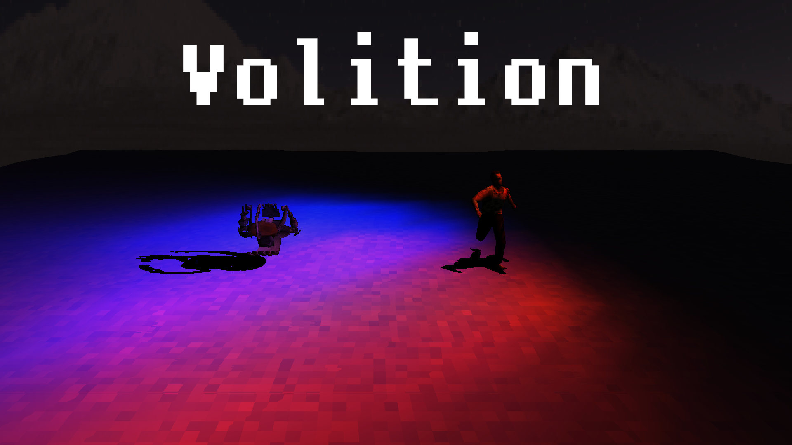
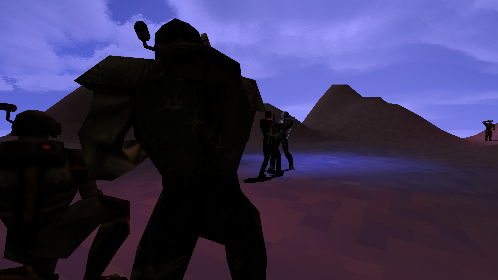
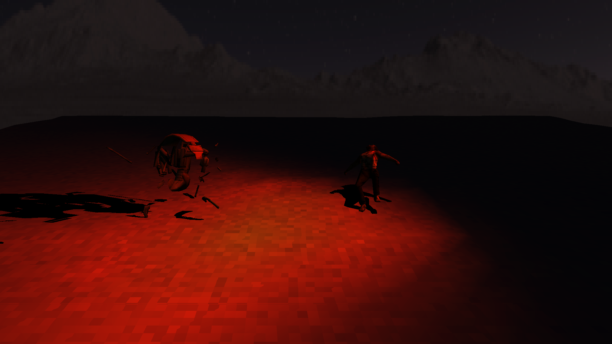
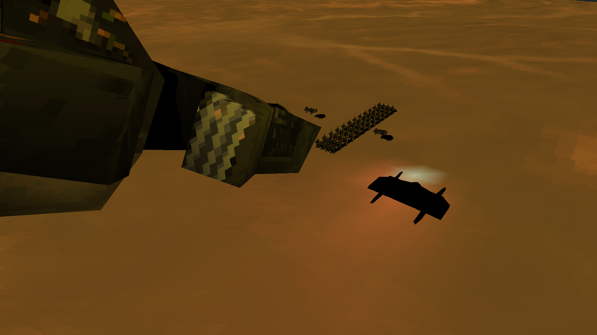
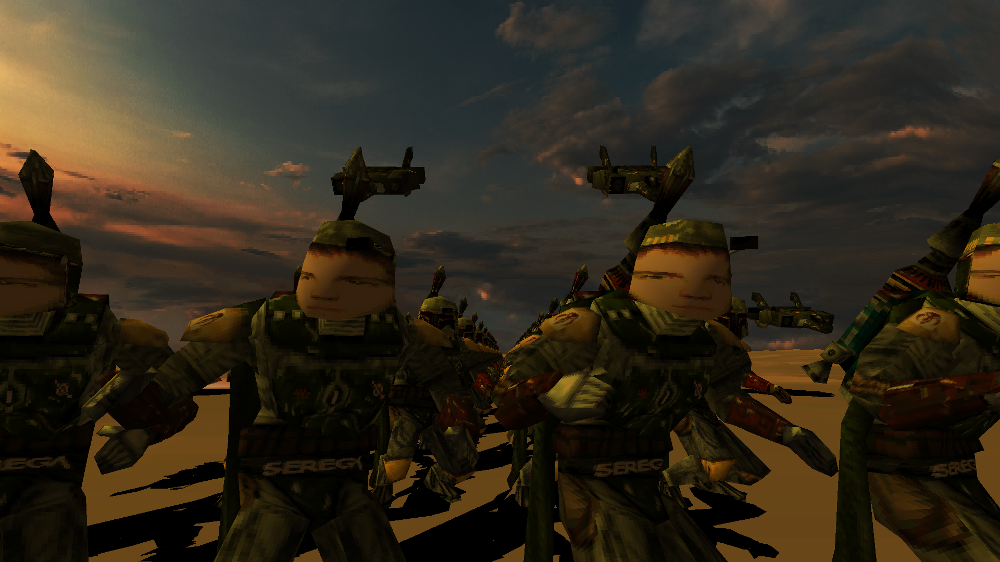
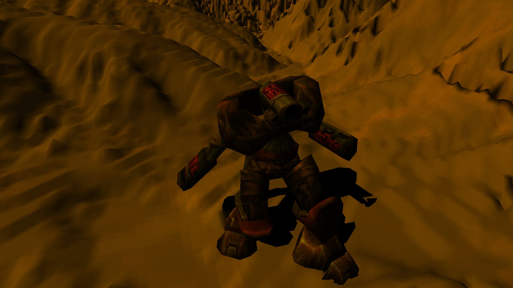
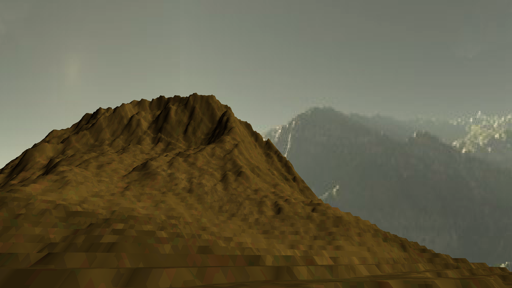
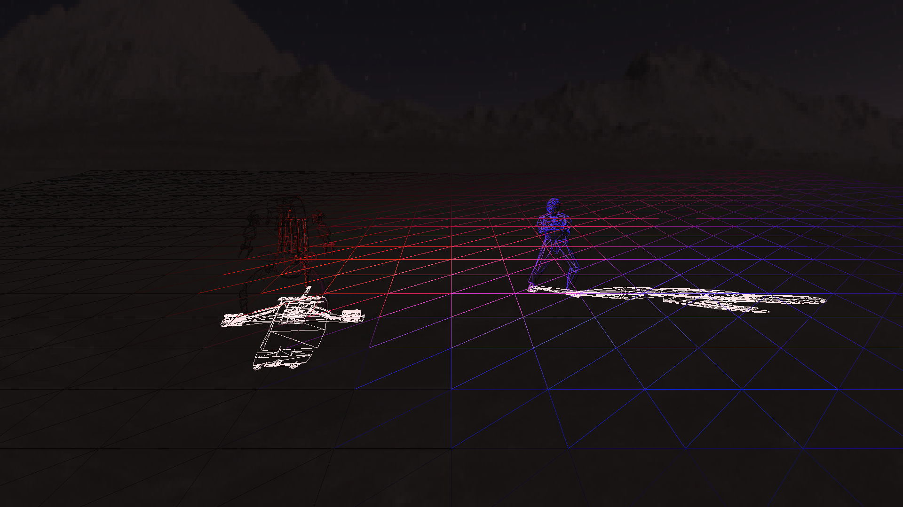

# Volition3D

## Summary

Volition3D is software renderer made for fun.
It includes 5 demo scenes to see what it has.

Watch demo: [YouTube Video](https://www.youtube.com/watch?v=Fexu4alx5lU)

Play demo: [Volition3D on Itch Io](https://snowfall-eagle.itch.io/volition3d-demo)

## Features
- Emissive, flat, gouraud shading
- Perspective correct, linear piecewise, affine texture mapping
- Billinear texture filtering, texture mipmapping
- Ambient, infinite, point, spotlight lights
- MD2, COB model loaders
- Shadows, MD2 animations
- Terrain generation
- Entity culling, backface culling and polygon clipping

## Build
1. Open Project/Volition/Volition.sln
2. Build Game and Launcher
3. Open Launcher.exe in Bin/Launcher
4. Set preferences
5. Play!

## Screenshots

